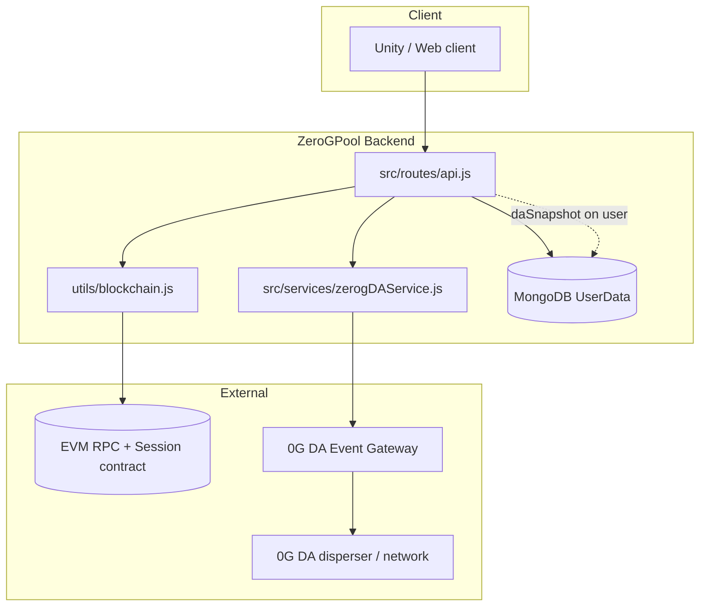

# 0G Integration in ZeroGPool (Backend)

This document describes how **0G** and **web3-adjacent** features are used in the **ZeroGPool** (`zerogpoolgame`) backend: what runs on-chain or off-chain, how **Data Availability (DA)** fits in, how data flows through login, and how to configure and operate everything.

The product is branded around “Zero G” / **0G Chain** in the broader Kult ecosystem; the backend implements two **independent** integrations you can enable separately:

1. **0G Data Availability (DA)** — session snapshots sent to a **0G DA Event Gateway** (HTTP).
2. **EVM “blockchain” sessions** — optional **generic** EVM contract calls via **ethers.js** (often pointed at **0G EVM mainnet** in production, but not hardcoded).

There is **no** 0G Storage SDK, 0G Compute broker, or indexer client in this service; only the gateway + optional EVM RPC.

---

## 1. Architecture overview

- **Login paths** may **record a session on an EVM contract** (if blockchain env is set) **and** queue a **DA** event (if DA is not disabled).
- **DA** never blocks the HTTP response for login: it runs in a **`setImmediate`** background job after the handler has prepared the reply (see `queueLoginSessionDA` in `src/routes/api.js`).
- **Blockchain** session recording is **awaited** on login when enabled, so slow RPC can affect latency unless you refactor that flow later.

---

## 2. 0G Data Availability (DA)

### 2.1 What it is doing here

The backend submits a structured **login session event** to a **hosted DA Event Gateway**. The gateway is responsible for batching / forwarding work toward the **0G DA layer** (e.g. blob dispersal and confirmation). ZeroGPool only speaks **HTTPS** to the gateway; it does not run disperser logic.

Canonical implementation: `src/services/zerogDAService.js`.

### 2.2 Game identity and event type

| Field | Value |
|-------|--------|
| HTTP `game` (JSON body) | `zeroGpool` (`GAME_ID`) |
| Event name | `session.login` |
| Player key | Wallet address (`identifier`) — lowercase in API routes |

### 2.3 Payload (`data`)

Built by `buildEventData` in `zerogDAService.js`:

- `identifier`, `walletAddress` — login wallet.
- `playerName` — from `playerData.playerNames0` or `"Anonymous"`.
- `stats` — `totalTimePlayed`, CPU/human games played/won, `totalBallsPocketed`, `ttBestScore`, `matrixBestScore`.
- `recordedAt` — ISO timestamp.

### 2.4 HTTP API used (gateway-facing)

| Operation | Method | Path | Notes |
|-----------|--------|------|--------|
| Ingest event | POST | `{GATEWAY}/v1/events` | Body includes `eventId`, `game`, `event`, `data`. Timeout 10s. |
| DA status | GET | `{GATEWAY}/v1/da/status/:eventId` | Poll processing / `daBlobInfo`. Timeout 8s. |
| Retrieve blob | POST | `{GATEWAY}/v1/da/retrieve/:eventId` | When finalized; decode `dataBase64` if present. Timeout 12s. |
| Health | GET | `{GATEWAY}/health` | Boot log uses `body.ready` when present. |

If the gateway requires auth, send:

`Authorization: Bearer <ZEROG_DA_API_KEY>`

### 2.5 When DA runs

DA is queued **after** successful login preparation, for:

- **`POST /api/auth/login`** — trigger stored as `login.auth`
- **`POST /api/v2/login`** — trigger stored as `login.v2`

**Not** emitted on `POST /api/user` save in the current code (only EVM session recording runs there when blockchain is enabled).

### 2.6 Correlation ID (`eventId`)

Each submit generates a **`randomUUID()`** `eventId` in the backend, sent in the POST body so the gateway can index the same id for `/status` and `/retrieve`. This mirrors the **Highway Hustle** pattern.

### 2.7 MongoDB: `daSnapshot` on `UserData`

After a successful gateway accept, the background job updates the user:

`UserData.daSnapshot`

| Field | Purpose |
|-------|--------|
| `eventId` | Last submitted DA event id for this user (overwritten on each successful login DA). |
| `daStatus` | e.g. `submitted`; may be enriched when `/api/da/status` polls a confirmed/finalized state. |
| `daReference`, `daBlobInfo` | Filled when status route merges gateway response. |
| `snapshotAt` | When we stored the submission. |
| `trigger` | `login.auth` or `login.v2`. |

Schema: `src/models/UserData.js`.

### 2.8 Public backend routes for DA (debug / ops)

Mounted under `/api` in `src/routes/api.js`:

| Route | Purpose |
|-------|--------|
| `GET /api/da/snapshot?wallet=<address>` | Read stored `daSnapshot` + build `gatewayStatusUrl`. |
| `GET /api/da/status?wallet=<address>` | Live poll gateway; may update `daSnapshot` blob fields when confirmed/finalized. |
| `GET /api/da/retrieve?wallet=<address>` | Retrieve decoded payload for last `eventId` when available. |
| `GET /api/da/health` | Proxy gateway health. |

**Security note:** These routes are **wallet-scoped** and **unauthenticated** in the current app. Treat them as operational endpoints; restrict at the edge (IP, VPN, or auth) if the API is public.

### 2.9 Environment variables (DA)

| Variable | Required | Description |
|----------|----------|-------------|
| `ZEROG_DA_API_KEY` | If gateway uses Bearer auth | Sent on ingest, status, and retrieve. |
| `ZEROG_DA_GATEWAY_URL` | No | Base URL, no trailing slash. Default: `https://da.warzonewarriors.xyz`. |
| `ZEROG_DA_ENABLED` | No | Set to `false` to disable **all** DA submits (status/retrieve routes can still call the gateway if you hit them manually). |

See `.env.example` for commented templates.

### 2.10 Failure behavior

- Submit failures are **logged** and do **not** fail login.
- If Mongo update after submit fails, login still succeeded; check logs for `[0g-da]`.
- Boot: `src/server.js` calls `zerogDAService.healthCheck()` and logs gateway URL + `online` bit.

---

## 3. EVM session contract (“blockchain” integration)

### 3.1 What it is

`src/utils/blockchain.js` uses **ethers v6** with:

- `JsonRpcProvider(BLOCKCHAIN_RPC_URL)`
- `Wallet(OPERATOR_PRIVATE_KEY)` as transaction signer
- `Contract(CONTRACT_ADDRESS, session ABI)`

It is **chain-agnostic**: any EVM JSON-RPC works. In a 0G-themed deployment you typically set `BLOCKCHAIN_RPC_URL` to **0G EVM** (e.g. public `https://evmrpc.0g.ai` and chain id **16661** for mainnet), but **this repo does not hardcode** that URL or chain id.

### 3.2 Contract surface (minimal ABI in code)

- `recordSession(address _user, statsTuple)` — write session stats for a player.
- `getUserLoginCount`, `getLatestSession`, `getTotalUsers`, `totalSessions` — reads / aggregates.
- Event `SessionRecorded` (declared in ABI for logs / tooling).

### 3.3 When it runs

When `blockchainService.isReady()`:

- **`POST /api/auth/login`** — awaits `recordSession`, optionally fetches `getUserLoginCount`, returns `blockchain` object with `txHash` / gas on success.
- **`POST /api/v2/login`** — same pattern.
- **`POST /api/user`** — if `updatedUser.stats` exists, awaits `recordSession` and returns `blockchain` in JSON.

If env is missing or init fails, blockchain is skipped with warnings; login can still succeed.

### 3.4 Environment variables (EVM)

| Variable | Purpose |
|----------|---------|
| `BLOCKCHAIN_RPC_URL` | EVM JSON-RPC endpoint. |
| `OPERATOR_PRIVATE_KEY` | Hot wallet that pays gas and signs `recordSession`. |
| `CONTRACT_ADDRESS` | Deployed session contract. |

### 3.5 Public routes

- `GET /api/blockchain/session/:walletAddress`
- `GET /api/blockchain/login-count/:walletAddress`
- `GET /api/blockchain/stats`

---

## 4. Wallet verification (not 0G-specific)

`src/controllers/referralController.js` uses **`ethers.verifyMessage`** for EIP-191 style referral signatures. That is **standard Ethereum** message recovery, not a 0G Labs product call. It works on any chain where the same address format is used.

---

## 5. What is *not* integrated

The following are **out of scope** for this backend as it exists today:

- **0G Storage** (upload/download via `@0glabs` / `@0gfoundation` SDKs)
- **0G Compute** (inference broker, chat completions)
- **0G DA** client libraries (only HTTP to the **Event Gateway**)
- Hardcoded **0G chain id** or **0G RPC** in DA code paths

---

## 6. File map

| Area | File |
|------|------|
| DA submit / status / retrieve / health | `src/services/zerogDAService.js` |
| Login + DA queue + `/api/da/*` | `src/routes/api.js` |
| EVM session service | `src/utils/blockchain.js` |
| User schema (`daSnapshot`) | `src/models/UserData.js` |
| Boot: blockchain init + DA health log | `src/server.js` |

---

## 7. Quick checklist for operators

1. **DA:** Set `ZEROG_DA_API_KEY` if the gateway requires it; confirm `ZEROG_DA_GATEWAY_URL` (or rely on default).
2. **DA:** After a login, check Mongo `UserData.daSnapshot.eventId` or call `GET /api/da/snapshot?wallet=...`.
3. **EVM:** Fund the operator wallet with the network’s native gas token; deploy or obtain the session contract and set `CONTRACT_ADDRESS`.
4. **Logs:** Search for `[0g-da]` and `Blockchain service` / `Recording session` in Winston output.

For general API setup (Mongo, JWT, CORS), see the main `README.md` in this folder.
