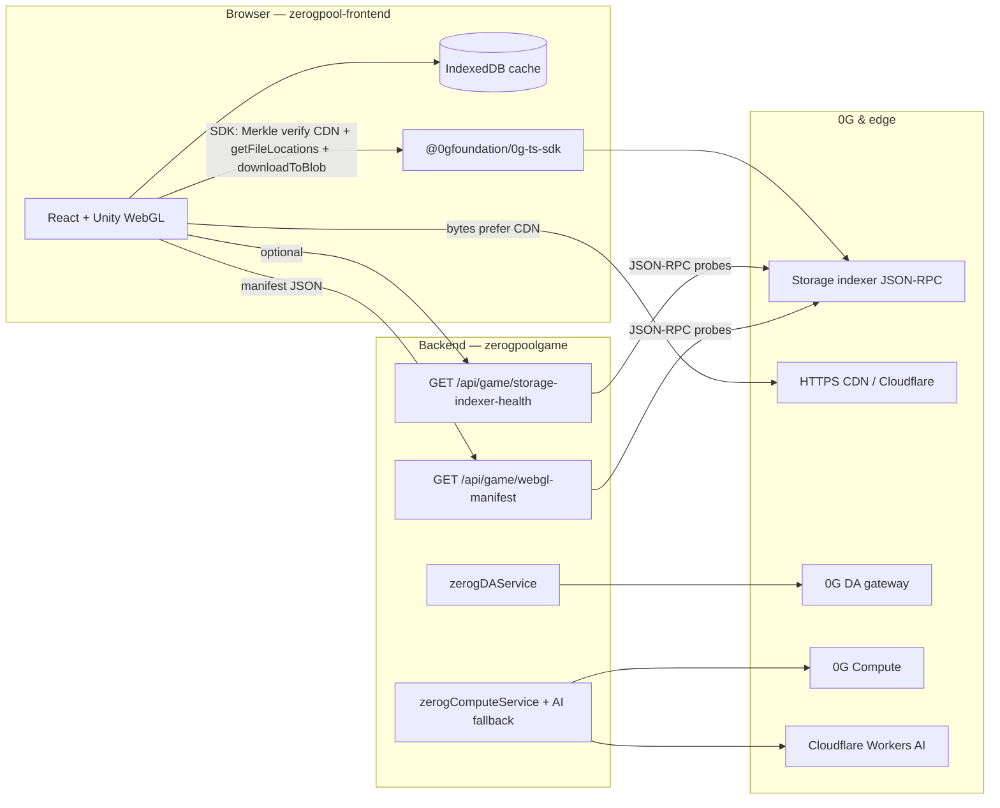

# ZeroGPool — 0G integration

Single reference for **how 0G is used** in this repo (`zeroGpool/`). Useful for reviewers, ops, and future you.

---

## Architecture (high level)



---

## 0G Storage (WebGL build)

| Piece | Path / route | Role |
|--------|----------------|------|
| **Manifest (full)** | `GET /api/game/webgl-manifest` | Returns `indexerUrl`, `entries[]` (`relative_path`, `root_hash`, `size_bytes`), optional `cdnBaseUrl`, `manifestSource` (`disk` \| `cloudflare`), optional **`manifestContentSha256`** (SHA-256 of the raw JSON bytes served from disk or CDN fallback), and **`storageIndexerProbe`** when probing is on. Invalid entries → **503** `MANIFEST_INVALID` with `errors[]`. |
| **Indexer health (compact)** | `GET /api/game/storage-indexer-health` | Same probe logic **without** returning the large `entries` array — for dashboards and quick `curl`. Always `200`; check boolean **`ok`** (false = indexer not reachable for probes, or **`reason: MANIFEST_INVALID`** if `entries` fail schema checks). `Cache-Control: no-store`. |
| **Browser loader** | `zerogpool-frontend/src/lib/zeroGGameBuild.ts` + `zeroGManifestSchema.ts` | Fetches manifest from API, fallback `public/manifest.json`. Validates **`entries`** (same rules as backend). For each file: **non-blocking** `getFileLocations`, then **CDN `fetch`** if `cdnBaseUrl` set. **By default**, recomputes the **0G Merkle root** from CDN bytes (`ZgStorageBlob` + `merkleTree()` in SDK) and **rejects** CDN if it ≠ manifest `root_hash`, then **`downloadToBlob`**. Writes **IndexedDB**. |
| **Backend probe** | `zerogpoolgame/src/utils/indexerStorageProbe.js` | Native `fetch` JSON-RPC (no SDK on Node): **`indexer_getShardedNodes`** (cluster snapshot, cached ~5 min on success) + **`indexer_getFileLocations`** for up to **three** roots: `Build/Game.loader.js`, `Build/Game.wasm`, and one **`StreamingAssets/**`** entry if distinct. Per-root cache ~90s success / ~20s on error. |
| **Static manifest files** | `zerogpoolgame/public/zeroGpool-play/webgl-0g-manifest.json` and `zerogpool-frontend/public/manifest.json` | Should stay **in sync** after each 0G upload. From `zerogpool-frontend`: **`yarn sync:webgl-0g-manifest`** runs `scripts/sync-webgl-0g-manifest.mjs` (copies frontend `public/manifest.json` → backend `webgl-0g-manifest.json`). |
| **Upload tooling** | `zeroG-storage-upload/upload-files-0g.mjs` | Offline upload; produces **`zeroGPool_0g_upload_manifest.jsonl`** with paths ↔ hashes. |

### Query / env toggles (Storage probe)

| Control | Effect |
|---------|--------|
| `GET .../webgl-manifest?probe=0` | Skip indexer RPCs (faster response). |
| `GAME_WEBGL_INDEXER_PROBE=false` | Same as `probe=0` for all clients. |
| `GAME_WEBGL_INDEXER_PROBE_TIMEOUT_MS` | Per-RPC ceiling (default `4500`, clamped in probe code). |
| `GAME_WEBGL_CDN_BASE_URL` | CDN origin for **fallback** manifest fetch if disk file missing; also merged as `cdnBaseUrl` when not in JSON. |
| `GAME_WEBGL_0G_MANIFEST_PATH` | Override path to `webgl-0g-manifest.json`. |

### CDN integrity (browser, default **on**)

After a successful CDN **`fetch`**, the client rebuilds the **same Merkle tree** the uploader used (`@0gfoundation/0g-ts-sdk` `Blob` + `merkleTree()`) and compares **`tree.rootHash()`** to the manifest **`root_hash`**. Mismatch or build error → **discard CDN bytes** and **`downloadToBlob`** from the indexer (same as a wrong or stale CDN object).

| Env | Effect |
|-----|--------|
| `VITE_ZG_STORAGE_VERIFY_CDN_ROOT` | Default **`1`** / on. Set **`0`** or **`false`** to trust CDN without Merkle check (debug only). |

### `storageIndexerProbe` shape (schema v2)

- **`probe_schema_version`**: `2`
- **`probed_at`**: ISO timestamp
- **`indexer_url`**: string used for JSON-RPC
- **`cluster`**: result of `indexer_getShardedNodes` — `{ ok, trusted_node_count?, all_node_count?, latency_ms, cached? }` or `{ ok: false, error, ... }`
- **`samples`**: array of `{ relative_path, ok, root_hash, location_count | error, latency_ms, cached? }`
- **`indexer_reachable`**: `true` if cluster **or** any sample succeeded
- **`all_locations_known`**: `true` if every **sample** has `ok` and locations (cluster may still fail independently)

---

## 0G DA (Data Availability)

| Item | Detail |
|------|--------|
| **Code** | `zerogpoolgame/src/services/zerogDAService.js` |
| **When** | Login, stats update, player name update — **queued** (`setImmediate`) so HTTP latency is not blocked |
| **Routes** | `GET /api/da/health`, status / retrieve under `/api/da/...` (see `src/routes/api.js`) |
| **Env** | `ZEROG_DA_GATEWAY_URL`, `ZEROG_DA_API_KEY`, `ZEROG_DA_ENABLED` |

---

## 0G Compute

| Item | Detail |
|------|--------|
| **Code** | `zerogpoolgame/src/services/zerogComputeService.js`, `aiPoolCommentService.js` |
| **When** | Leaderboard AI commentary — **0G Compute first**, **Cloudflare Workers AI** on failure or bad output |
| **Env** | `ZEROG_API_KEY` / `ZEROG_COMPUTE_API_KEY`, `ZEROG_BASE_URL`, model and timeout vars (see server `GET /api/health` for flags) |

---

## Frontend env

| Variable | Purpose |
|----------|---------|
| `VITE_BACKEND_URL` | API base including `/api` — used for manifest + auth |
| `VITE_ZG_STORAGE_INDEXER_URL` | Optional override for indexer URL (else manifest’s `indexerUrl` or default turbo URL) |
| `VITE_ZG_STORAGE_VERIFY_CDN_ROOT` | **`1`** (default): verify CDN bytes match manifest `root_hash` via SDK Merkle tree. **`0`**: skip verify. |

See `zerogpool-frontend/.env.example`.

---

## Copy-paste checks

Replace `API` with your host (e.g. `https://zerogpoolgame.onrender.com`).

```bash
# Full manifest + probe (large JSON)
curl -sS "API/api/game/webgl-manifest" | jq '{manifestSource, manifestContentSha256, indexerUrl, cdnBaseUrl, probe: .storageIndexerProbe | {probe_schema_version, probed_at, indexer_reachable, cluster, sample_count: (.samples|length)}}'

# Compact health (no entries[])
curl -sS "API/api/game/storage-indexer-health" | jq .

# Skip RPCs (latency / CI)
curl -sS "API/api/game/webgl-manifest?probe=0" | jq '{manifestSource, entry_count: (.entries|length)}'

# DA
curl -sS "API/api/da/health" | jq .
```

---

## Troubleshooting

| Symptom | Things to check |
|---------|------------------|
| **`storageIndexerProbe.cluster` fails** | Indexer URL reachable from **server** egress; try `indexer_getShardedNodes` with same URL in `curl` POST. |
| **Samples `ok` but `location_count: 0`** | Root not indexed yet — re-upload or wait for indexer propagation. |
| **CDN works in browser but probe OK** | Probe hits **indexer** only; CDN CORS is separate — ensure CDN sends `Access-Control-Allow-Origin` for your web origin. |
| **Manifest 503 `MANIFEST_UNAVAILABLE`** | Ship `webgl-0g-manifest.json` on the API host **or** set `GAME_WEBGL_CDN_BASE_URL` so CDN fallback can load `manifest.json`. |
| **Manifest 503 `MANIFEST_INVALID`** | Response includes `errors[]` — fix `entries` (`0x` + 64 hex `root_hash`, non-empty `relative_path`, no duplicate roots, valid `size_bytes`). |
| **Stale game in browser** | Bump hashes in manifest after upload; clear **IndexedDB** for origin `zerogpool-webgl-0g` if needed. |
| **Logs: `CDN Merkle root mismatch` then 0G download** | CDN object does not match on-chain / indexer Merkle root — fix CDN mirror or manifest hashes; or temporarily `VITE_ZG_STORAGE_VERIFY_CDN_ROOT=0` to confirm CDN is the culprit. |

---

## Design choices (intentional)

1. **Game bytes** load in the **browser** (CDN first when configured) so the API is not a large binary proxy.
2. **CDN is not trusted blindly**: Merkle **root** must match **`root_hash`** in the manifest (same algorithm as upload), then bytes are cached in IndexedDB.
3. **Backend** uses **JSON-RPC** against the indexer to prove **liveness + dataset routing** without downloading full WASM/data on the server.
4. **`storage-indexer-health`** returns **HTTP 200** with **`ok: false`** when degraded so generic uptime checks do not flap; use the JSON **`ok`** field for readiness.

---

## Tests & CI

| Where | Command | What it covers |
|-------|---------|----------------|
| Frontend | `cd zeroGpool/zerogpool-frontend && yarn test` | Vitest — manifest schema helpers (`zeroGManifestSchema.ts`). |
| Frontend build | `yarn build` | `tsc -b` + Vite (CI runs this too). |
| Backend | `cd zeroGpool/zerogpoolgame && npm test` | Node `node:test` — `webglManifestValidate.js` (aligned with frontend rules). |
| GitHub Actions | `.github/workflows/zeroG-ci.yml` | On changes under `zeroGpool/zerogpool-frontend` or `zeroGpool/zerogpoolgame`: frontend `yarn test` + `yarn build`, backend `npm test`. |

---

## Not implemented (optional “10/10” extras)

- **Signed manifest** (JWS / Ed25519) or on-chain manifest hash pin.
- **Server-side** byte proxy from indexer (auth, bandwidth on API).
- **Automated tests** for indexer JSON-RPC probes and full SDK Merkle verify in the browser (heavier; schema + manifest validation are covered in CI today).
