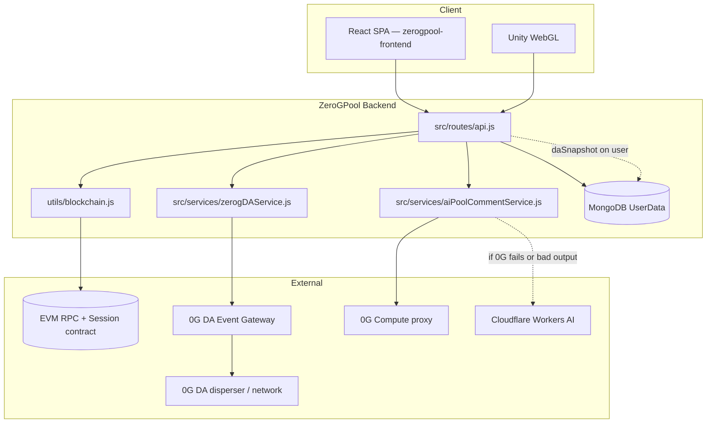

# 0G Integration in ZeroGPool

This document describes how **0G** and **web3-adjacent** features are used across **ZeroGPool**: the **`zerogpoolgame`** backend (API, DA, optional EVM session writes, compute) and the **`zerogpool-frontend`** web app (wallet UX, chain enforcement, explorer links). Paths below are relative to each package root.

The product is branded around “Zero G” / **0G Chain** in the broader Kult ecosystem. The **backend** implements **three** integrations you can enable separately:

1. **0G Data Availability (DA)** — session / stats / name events to a **0G DA Event Gateway** (HTTP).
2. **EVM session contract** — optional **generic** EVM calls via **ethers.js** (typically **0G EVM mainnet** in production; not hardcoded).
3. **0G Compute** — leaderboard AI commentary via OpenAI-compatible `/chat/completions` on the 0G compute proxy, with **Cloudflare Workers AI** as fallback (same operational pattern as **Highway Hustle**).

**Unity WebGL:** the game shell is **static** under `public/zeroGpool-play/` (served at `GET /zeroGpool-play/`). The backend does **not** proxy build bytes from R2 or 0G Storage. **Uploads** to 0G (if you use them) are done offline; `zeroGPool_0g_upload_manifest.jsonl` can still map filenames → hashes for your own tooling.

---

## 1. Architecture overview

- **Login / save / name** may **record a session on an EVM contract** (if blockchain env is set) **and** queue a **DA** event (if DA is not disabled).
- **DA** never blocks the HTTP response for those mutations: it runs in a **`setImmediate`** background job (`queueDA` in `src/routes/api.js`).
- **Blockchain** session recording is **awaited** on login and user save when enabled, so slow RPC can affect latency for those routes.
- **Leaderboard AI** (`GET /api/leaderboard/ai-comment`) calls **0G Compute first**, then **Cloudflare** if needed.

---

## 2. 0G Data Availability (DA)

### 2.1 What it is doing here

The backend submits structured **game events** (`session.login`, `stats.update`, `player.name`) to a **hosted DA Event Gateway**. The gateway batches / forwards work toward the **0G DA layer** (e.g. blob dispersal and confirmation). ZeroGPool only speaks **HTTPS** to the gateway; it does not run disperser logic.

Canonical implementation: `src/services/zerogDAService.js`.

### 2.2 Game identity and event names

| Field | Value |
|-------|--------|
| HTTP `game` (JSON body) | `zeroGpool` (`GAME_ID`) |
| Event names | `session.login`, `stats.update`, `player.name` |
| Player key | Wallet address — lowercase in API routes |

### 2.3 Payload (`data`)

Built by `buildLoginData`, `buildStatsData`, or `buildNameData` in `zerogDAService.js` depending on event:

- `identifier`, `walletAddress` — login wallet.
- `playerName` — from `playerData.playerNames0` or `"Anonymous"`.
- `stats` — `totalTimePlayed`, CPU/human games played/won, `totalBallsPocketed`, `ttBestScore`, `matrixBestScore`.
- `recordedAt` — ISO timestamp.

### 2.4 HTTP API used (gateway-facing)

| Operation | Method | Path | Notes |
|-----------|--------|------|--------|
| Ingest event | POST | `{GATEWAY}/v1/events` | Body includes `eventId`, `game`, `event`, `data`. Timeout 10s. |
| DA status | GET | `{GATEWAY}/v1/da/status/:eventId` | Poll processing / `daBlobInfo`. Timeout 8s. |
| Retrieve blob | POST | `{GATEWAY}/v1/da/retrieve/:eventId` | When finalized; decode `dataBase64` if present. Timeout 12s. |
| Health | GET | `{GATEWAY}/health` | Boot log uses `body.ready` when present. |

If the gateway requires auth, send:

`Authorization: Bearer <ZEROG_DA_API_KEY>`

### 2.5 When DA runs

DA is queued **after** the handler prepares the user document (fire-and-forget via `queueDA`), for:

| Route | Trigger label | Event name |
|-------|-----------------|------------|
| `POST /api/auth/login` | `login.auth` | `session.login` |
| `POST /api/v2/login` | `login.v2` | `session.login` |
| `POST /api/user` | `user.save` | `stats.update` |
| `POST /api/player/name` | `player.name` | `player.name` |

### 2.6 Correlation ID (`eventId`)

Each submit generates a **`randomUUID()`** `eventId` in the backend, sent in the POST body so the gateway can index the same id for `/status` and `/retrieve`. This mirrors the **Highway Hustle** pattern.

### 2.7 MongoDB: `daSnapshot` on `UserData`

After a successful gateway accept, the background job updates the user:

`UserData.daSnapshot`

| Field | Purpose |
|-------|--------|
| `eventId` | Last submitted DA event id for this user (overwritten on each successful login DA). |
| `daStatus` | e.g. `submitted`; may be enriched when `/api/da/status` polls a confirmed/finalized state. |
| `daReference`, `daBlobInfo` | Filled when status route merges gateway response. |
| `snapshotAt` | When we stored the submission. |
| `trigger` | `login.auth` or `login.v2`. |

Schema: `src/models/UserData.js`.

### 2.8 Public backend routes for DA (debug / ops)

Mounted under `/api` in `src/routes/api.js`:

| Route | Purpose |
|-------|--------|
| `GET /api/da/snapshot?wallet=<address>` | Read stored `daSnapshot` + build `gatewayStatusUrl`. |
| `GET /api/da/status?wallet=<address>` | Live poll gateway; may update `daSnapshot` blob fields when confirmed/finalized. |
| `GET /api/da/retrieve?wallet=<address>` | Retrieve decoded payload for last `eventId` when available. |
| `GET /api/da/health` | Proxy gateway health. |

**Security note:** These routes are **wallet-scoped** and **unauthenticated** in the current app. Treat them as operational endpoints; restrict at the edge (IP, VPN, or auth) if the API is public.

### 2.9 Environment variables (DA)

| Variable | Required | Description |
|----------|----------|-------------|
| `ZEROG_DA_API_KEY` | If gateway uses Bearer auth | Sent on ingest, status, and retrieve. |
| `ZEROG_DA_GATEWAY_URL` | No | Base URL, no trailing slash. Default: `https://da.warzonewarriors.xyz`. |
| `ZEROG_DA_ENABLED` | No | Set to `false` to disable **all** DA submits (status/retrieve routes can still call the gateway if you hit them manually). |

See `.env.example` for commented templates.

### 2.10 Failure behavior

- Submit failures are **logged** and do **not** fail login.
- If Mongo update after submit fails, login still succeeded; check logs for `[0g-da]`.
- Boot: `src/server.js` calls `zerogDAService.healthCheck()` and logs gateway URL + `online` bit.

---

## 3. EVM session contract (“blockchain” integration)

### 3.1 What it is

`src/utils/blockchain.js` uses **ethers v6** with:

- `JsonRpcProvider(BLOCKCHAIN_RPC_URL)`
- `Wallet(OPERATOR_PRIVATE_KEY)` as transaction signer
- `Contract(CONTRACT_ADDRESS, session ABI)`

It is **chain-agnostic**: any EVM JSON-RPC works. In a 0G-themed deployment you typically set `BLOCKCHAIN_RPC_URL` to **0G EVM** (e.g. public `https://evmrpc.0g.ai` and chain id **16661** for mainnet), but **this repo does not hardcode** that URL or chain id.

### 3.2 Contract surface (minimal ABI in code)

- `recordSession(address _user, statsTuple)` — write session stats for a player.
- `getUserLoginCount`, `getLatestSession`, `getTotalUsers`, `totalSessions` — reads / aggregates.
- Event `SessionRecorded` (declared in ABI for logs / tooling).

### 3.3 When it runs

When `blockchainService.isReady()`:

- **`POST /api/auth/login`** — awaits `recordSession`, optionally fetches `getUserLoginCount`, returns `blockchain` object with `txHash` / gas on success.
- **`POST /api/v2/login`** — same pattern.
- **`POST /api/user`** — if `updatedUser.stats` exists, awaits `recordSession` and returns `blockchain` in JSON.

If env is missing or init fails, blockchain is skipped with warnings; login can still succeed.

### 3.4 Environment variables (EVM)

| Variable | Purpose |
|----------|---------|
| `BLOCKCHAIN_RPC_URL` | EVM JSON-RPC endpoint. |
| `OPERATOR_PRIVATE_KEY` | Hot wallet that pays gas and signs `recordSession`. |
| `CONTRACT_ADDRESS` | Deployed session contract. |

### 3.5 Public routes

- `GET /api/blockchain/session/:walletAddress`
- `GET /api/blockchain/login-count/:walletAddress`
- `GET /api/blockchain/stats`

---

## 4. Wallet verification (not 0G-specific)

`src/controllers/referralController.js` uses **`ethers.verifyMessage`** for EIP-191 style referral signatures. That is **standard Ethereum** message recovery, not a 0G Labs product call. It works on any chain where the same address format is used.

---

## 5. 0G Compute + Cloudflare fallback (leaderboard commentary)

### 5.1 Behavior

`src/services/aiPoolCommentService.js` loads the **current player** and **#1 by `stats.totalBallsPocketed`**, builds a small JSON snapshot (`src/services/zerogComputeService.js`), then:

1. **POST** `{ZEROG_BASE_URL}/chat/completions` with `Authorization: Bearer {ZEROG_API_KEY}` (0G Compute proxy — same default base URL pattern as Highway Hustle).
2. If HTTP fails, times out, or the model returns unusable text → **POST** Cloudflare `.../accounts/{id}/ai/v1/chat/completions` with `CF_API_TOKEN`.

Response includes `_meta.source`: `0g_compute` | `cloudflare_fallback` | `null`.

### 5.2 Route

| Method | Path | Query |
|--------|------|--------|
| GET | `/api/leaderboard/ai-comment` | `wallet` — `0x` + 40 hex (same validation as other wallet fields) |

### 5.3 Environment variables (compute + CF)

| Variable | Required for | Description |
|----------|----------------|-------------|
| `ZEROG_API_KEY` (or `ZERO_G_API_KEY` / `ZEROG_COMPUTE_API_KEY`) | 0G path | Bearer token for compute proxy. |
| `ZEROG_BASE_URL` | No | Default: `https://compute-network-1.integratenetwork.work/v1/proxy` |
| `ZEROG_MODEL` | No | Default model if `ZEROG_POOL_MODEL` unset. |
| `ZEROG_POOL_MODEL` | No | Overrides model for pool commentary only. |
| `ZEROG_POOL_MAX_TOKENS` | No | Default `150` (clamped 16–512). |
| `ZEROG_POOL_TIMEOUT_MS` | No | Default `8000`. |
| `CF_ACCOUNT_ID` | CF fallback | Cloudflare account id. |
| `CF_API_TOKEN` | CF fallback | Token with Workers AI access. |
| `CF_LLM_MODEL` | No | e.g. `@cf/meta/llama-3.1-8b-instruct-fast` |
| `CF_TIMEOUT_MS` | No | Default `6000`. |

`GET /api/health` exposes booleans `zerog.computeConfigured` and `zerog.cloudflareFallbackConfigured` (no secrets).

---

## 6. WebGL build: same-origin static files

| Artifact | Role |
|----------|------|
| `public/zeroGpool-play/manifest.json` | Lists Unity filenames (and optional hashes if you maintain them for tooling). |
| `public/zeroGpool-play/bootstrap.js` | **`fetch()`** each build file **same-origin** (URLs next to the shell), then injects loader + `createUnityInstance`. Optional meta `zgp-streaming-assets-base` overrides **StreamingAssets** base URL. |

Deploy the real **`.data` / `.wasm` / `.js` / framework** files (and **`StreamingAssets/`** if needed) under `public/zeroGpool-play/` so every URL the bootstrap resolves returns **200**.

To upload an entire WebGL tree (e.g. `zeroGpool/downloadGameR2/Game`) to **0G Storage** and refresh hashes in `manifest.json`, use **`zeroG-storage-upload`**: `npm run upload:zerogpool-game` (details in `zeroGpool/downloadGameR2/README.md`). The shell still loads artifacts **same-origin** from disk; **root_hash** is recorded for provenance unless you add indexer-based fetching.

---

## 7. zerogpool-frontend (web client)

The React app does **not** talk to the 0G DA gateway, 0G Compute proxy, or 0G Storage indexer APIs directly. **0G** here means **targeting the 0G EVM network** (default **chain id 16661**), public **RPC** / **block explorer** URLs, and copy that reflects “session on 0G” when users connect wallets. Session DA and on-chain session writes still happen in the **backend** when users call login/user APIs.

### 7.1 Assessment (how complete the frontend 0G story is)

Roughly **6.5 / 10** for “0G-aware wallet product” today:

| Strengths | Gaps |
|-----------|------|
| Env-driven **allowed chain** (`VITE_ALLOWED_*`) with sensible **0G Mainnet** fallbacks in `useChainEnforcement`, `NetworkModal`, `LoginModal`, `Layout`, Gate flow | **`VITE_ALLOWED_STORAGE_INDEXER`** is parsed into `AllowedChainConfig.storageIndexerUrl` in `src/lib/chain.ts` but **nothing in the UI reads it yet** — reserved for future storage-aware features |
| **`wallet_switchEthereumChain` / `wallet_addEthereumChain`** so users land on the right network | **Duplicated** default chain objects across several components instead of one exported constant |
| **Privy** + external wallets; **Gate Wallet** path checks network before handing off | No in-browser **0G Storage** download/upload, no **DA** client, no **compute** calls from the SPA |
| **`transaction.tsx`** / **`BlockchainToast.tsx`** use **chainscan.0g.ai** for tx links when configured for 0G | Game iframe URL is env/R2-driven (`GamePage`); not part of backend static WebGL unless you set `VITE_UNITY_GAME_URL` accordingly |

This is appropriate if the frontend’s job is **wallet + chain UX** and the backend owns **DA / EVM session / AI**.

### 7.2 Environment variables (frontend)

| Variable | Required | Description |
|----------|----------|-------------|
| `VITE_ALLOWED_CHAIN_ID` | No* | Decimal chain id; if unset, components use hardcoded **16661** defaults. |
| `VITE_ALLOWED_CHAIN_NAME` | No | e.g. `0G Mainnet`. |
| `VITE_ALLOWED_RPC_URL` | No | e.g. `https://evmrpc.0g.ai`. |
| `VITE_ALLOWED_EXPLORER_URL` | No | e.g. `https://chainscan.0g.ai`. |
| `VITE_ALLOWED_NATIVE_NAME` / `VITE_ALLOWED_NATIVE_SYMBOL` / `VITE_ALLOWED_NATIVE_DECIMALS` | No | Native currency display / `wallet_addEthereumChain`. |
| `VITE_ALLOWED_STORAGE_INDEXER` | No | Parsed into config only; **not used** by components yet (e.g. `https://indexer-storage-turbo.0g.ai`). |
| `VITE_CHAIN_CAIP2` | No | Used in `transaction.tsx`; default `eip155:16661`. |
| `VITE_BACKEND_URL` | Yes for API | Base URL for REST (`/api` appended when needed in `api.ts`). |

\*Strictly optional because of code defaults, but set them in production so deployments do not rely on scattered literals.

### 7.3 File map (frontend)

| Area | File |
|------|------|
| Allowed chain from env | `zerogpool-frontend/src/lib/chain.ts` |
| Auto / manual switch to allowed chain | `zerogpool-frontend/src/hooks/useChainEnforcement.ts` |
| Wrong-network UI | `zerogpool-frontend/src/components/NetworkModal.tsx` |
| Login + `wallet_addEthereumChain` data | `zerogpool-frontend/src/components/LoginModal.tsx` |
| Header / gating vs allowed chain | `zerogpool-frontend/src/components/Layout.tsx` |
| Gate Web3 + 0G network checks | `zerogpool-frontend/src/components/GateWalletConnectButton.tsx`, `src/lib/gateWallet.ts` |
| Tx link + CAIP2 | `zerogpool-frontend/src/components/transaction.tsx`, `BlockchainToast.tsx` |
| Auth shell | `zerogpool-frontend/src/main.tsx` (Privy) |

---

## 8. What is *not* integrated

- **0G Storage uploads** from this service (manifest is produced elsewhere).
- **0G DA** gRPC client libraries — only HTTP to the **Event Gateway**.
- Hardcoded **0G chain id** or **0G RPC** in DA or compute code paths (RPC is env-driven).
- **Frontend:** no direct calls to 0G Storage indexer, DA gateway, or compute (see §7).

---

## 9. File map (backend)

| Area | File |
|------|------|
| DA submit / status / retrieve / health | `src/services/zerogDAService.js` |
| 0G Compute config + pool player snapshot | `src/services/zerogComputeService.js` |
| Pool AI commentary (0G → CF) | `src/services/aiPoolCommentService.js` |
| Unity WebGL shell (static) | `public/zeroGpool-play/index.html`, `bootstrap.js`, `manifest.json` |
| Upload manifest (filenames ↔ root_hash) | `zeroGPool_0g_upload_manifest.jsonl` |
| Login + DA queue + `/api/da/*` + leaderboard AI route | `src/routes/api.js` |
| EVM session service | `src/utils/blockchain.js` |
| User schema (`daSnapshot`) | `src/models/UserData.js` |
| Boot: blockchain init + DA health log | `src/server.js` |

---

## 10. Quick checklist for operators

1. **DA:** Set `ZEROG_DA_API_KEY` if the gateway requires it; confirm `ZEROG_DA_GATEWAY_URL` (or rely on default).
2. **DA:** After a login, check Mongo `UserData.daSnapshot.eventId` or call `GET /api/da/snapshot?wallet=...`.
3. **EVM:** Fund the operator wallet with the network’s native gas token; deploy or obtain the session contract and set `CONTRACT_ADDRESS`.
4. **0G Compute:** Set `ZEROG_API_KEY`; optional CF vars for fallback.
5. **Logs:** Search for `[0g-da]`, `[0g-pool-ai]`, and `Blockchain service` / `Recording session` in Winston output.
6. **Frontend:** Set `VITE_ALLOWED_*` to match the 0G deployment; confirm wallets can switch to **16661** and that explorer links resolve on **chainscan.0g.ai**.

For general API setup (Mongo, JWT, CORS), see the main `README.md` in **`zerogpoolgame`**. For the SPA, see **`zerogpool-frontend`** README / `.env.example` if present.
